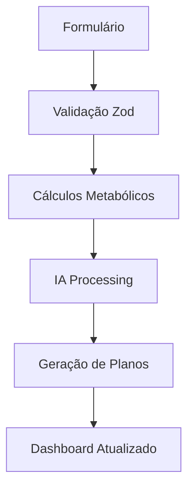
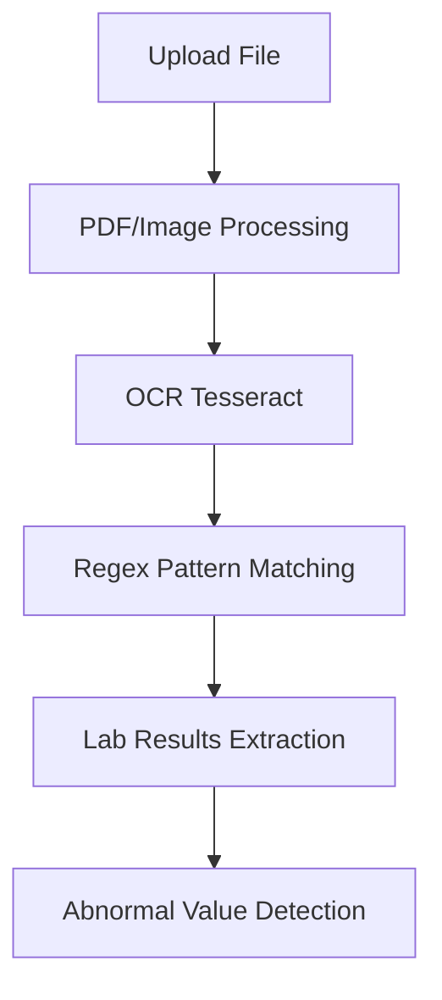

# 🚀 Como Usar o MaDRIA - Medical AI Digital Assistant

## 📋 Fluxo Completo do Sistema

### 1. **Página Inicial**
- Acesse `http://localhost:3000`
- Interface moderna com logo do Monolito inspirada em 2001: Uma Odisseia no Espaço
- Apresentação das funcionalidades do MaDRIA
- Botões para "Começar" e "Ver Demo"

### 2. **Onboarding (Cadastro)**
- Acesse `/onboarding` ou clique em "Começar"
- **5 etapas estruturadas:**

#### 📝 Etapa 1: Informações Pessoais
- Nome, email, data de nascimento
- Altura, peso, gênero
- Telefone e contato de emergência
- **Validação automática** de todos os campos

#### 🏥 Etapa 2: Histórico Médico
- Status de tabagismo e consumo de álcool
- Frequência de exercício atual
- Alergias, medicamentos, condições crônicas
- Histórico de cirurgias

#### 🎯 Etapa 3: Objetivos
- Objetivo principal (perda de peso, ganho de massa, etc.)
- Peso meta e prazo
- Duração preferida de treino
- Restrições alimentares
- Dias disponíveis para exercício

#### 📄 Etapa 4: Upload de Exames
- Drag & drop ou seleção de arquivos
- **Formatos aceitos:** PDF, JPG, PNG
- **Processamento automático:** OCR + análise de valores
- **Extração inteligente** de resultados laboratoriais

#### ✅ Etapa 5: Revisão
- Visualização completa dos dados inseridos
- Confirmação final antes do envio

### 3. **Dashboard Principal**
- Acesse `/dashboard` após completar o onboarding
- **Métricas em tempo real:**
  - Peso atual e tendência
  - Calorias consumidas vs. meta
  - Hidratação diária
  - Qualidade do sono

- **Próximas atividades:**
  - Treinos agendados
  - Refeições planejadas
  - Lembretes de hidratação

- **Progresso semanal:**
  - Gráficos de adesão ao treino
  - Acompanhamento nutricional
  - Indicadores visuais de performance

### 4. **Upload de Exames**
- Acesse `/upload` ou pelo dashboard
- **Funcionalidades:**
  - Upload múltiplo de arquivos
  - OCR automático (Tesseract.js)
  - Extração de valores laboratoriais
  - Identificação de valores anormais
  - Visualização do texto extraído

## 🧠 Como a IA Funciona

### Análise de Exames
```typescript
// Padrões reconhecidos automaticamente:
- Glicose: XX mg/dl
- Colesterol total: XXX mg/dl  
- HDL, LDL, Triglicerídeos
- Hemoglobina, Creatinina, Ureia
- TSH, T4 (hormônios tireoidianos)
```

### Geração de Planos
```typescript
// Entrada para IA:
PersonalInfo + Goals + MedicalHistory + LabResults

// Saída da IA:
{
  workout_plan: [...],      // Treinos personalizados
  nutrition_plan: [...],    // Dieta com macros
  calendar_events: [...],   // Cronograma completo
  daily_messages: [...],    // Mensagens motivacionais
  alerts: [...],            // Alertas de segurança
  recommendations: [...]    // Sugestões gerais
}
```

## 📊 Dados Processados

### Cálculos Automáticos
- **IMC:** Peso / (Altura²)
- **BMR:** Fórmula de Harris-Benedict
- **TDEE:** BMR × Fator de atividade
- **Calorias meta:** TDEE ± déficit/superávit

### Fatores de Risco Identificados
- Sobrepeso/Obesidade (IMC ≥ 25)
- Tabagismo ativo
- Consumo excessivo de álcool
- Sedentarismo
- Valores laboratoriais anormais

## 🔒 Segurança e Validação

### Validação de Entrada (Zod)
```typescript
// Todos os formulários validados:
- Email format
- Idade entre 18-120 anos
- Peso entre 30-300 kg
- Altura entre 100-250 cm
- Arquivos máximo 10MB
```

### Alertas de Segurança
- **Valores críticos:** Glicemia > 200 mg/dl
- **Recomendação médica:** IMC ≥ 30
- **Disclaimer:** Nunca substitui consulta médica

## 🎨 Interface e UX

### Design System
- **Colors:** Blue (primário), Green (sucesso), Red (alertas)
- **Typography:** Font weights hierárquicos
- **Icons:** Lucide React (consistente)
- **Layout:** Responsive mobile-first

### Componentes Reutilizáveis
- **MetricCard:** Exibição de métricas com ícones
- **ProgressBar:** Barras de progresso animadas  
- **FileUpload:** Drag & drop com preview
- **AlertPanel:** Notificações categorizadas

## 📱 Responsividade

### Breakpoints
- **Mobile:** < 768px
- **Tablet:** 768px - 1024px  
- **Desktop:** > 1024px

### Adaptações
- Grid responsivo (1-2-3-4 colunas)
- Navigation collapse em mobile
- Touch-friendly buttons
- Swipe gestures (futuro)

## 🚀 Performance

### Otimizações Implementadas
- **Server Components:** Renderização no servidor
- **Code Splitting:** Bundle otimizado
- **Image Optimization:** Next.js Image
- **Font Loading:** Preload automático

### Métricas de Performance
- **FCP:** < 1.5s (First Contentful Paint)
- **LCP:** < 2.5s (Largest Contentful Paint)
- **CLS:** < 0.1 (Cumulative Layout Shift)

## 🔄 Fluxos de Dados

### Onboarding → IA → Dashboard


### Upload → OCR → Análise


## 📈 Roadmap de Funcionalidades

### ✅ Implementado (MVP)
- Interface completa
- Onboarding estruturado
- Upload e OCR
- Dashboard interativo
- Cálculos metabólicos básicos

### 🚧 Em Desenvolvimento
- Integração OpenAI/Claude
- Base de dados Supabase
- Autenticação NextAuth
- WhatsApp Business API

### 📋 Próximas Features
- Gráficos avançados (Chart.js)
- Exportação de relatórios PDF
- Integração com wearables
- Sync calendário Google/Outlook
- Gamificação com pontuação

## 🛠️ Comandos Úteis

### Desenvolvimento
```bash
npm run dev          # Servidor desenvolvimento
npm run build        # Build produção
npm run start        # Servidor produção
npm run lint         # ESLint check
npm run type-check   # TypeScript check
```

### Debug e Logs
```bash
# Visualizar logs do servidor
tail -f .next/server/trace

# Verificar bundle size
npm run analyze

# Performance testing
npm run lighthouse
```

## 🤝 Contribuição

### Setup Local
1. Fork do repositório
2. `npm install`
3. Configurar `.env.local`
4. `npm run dev`
5. Abrir `http://localhost:3000`

### Guidelines
- **Commits:** Conventional Commits
- **Branches:** feature/fix/docs/style
- **Code Review:** Obrigatório para main
- **Tests:** Implementar com Jest (futuro)

---

**🎯 O MaDRIA está pronto para transformar a maneira como você cuida da sua saúde!**

Como o Monolito de 2001, MaDRIA representa um salto evolutivo - desta vez na medicina personalizada através da inteligência artificial.
